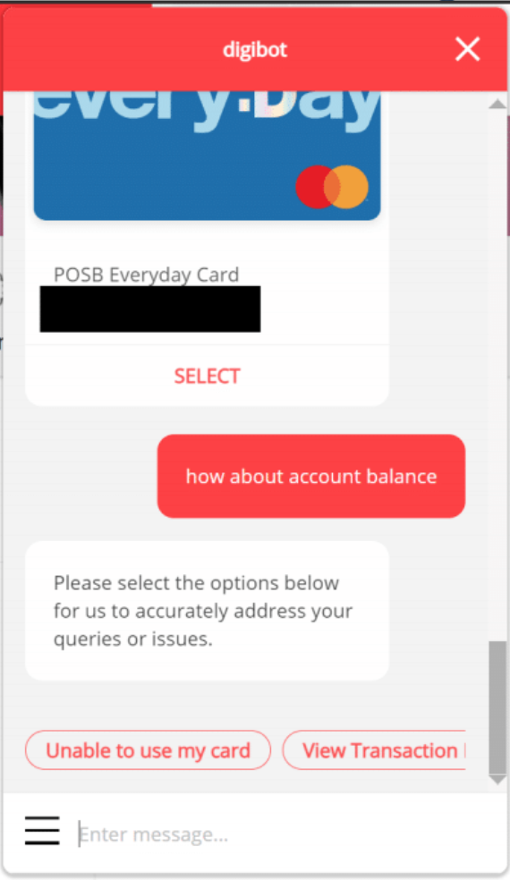
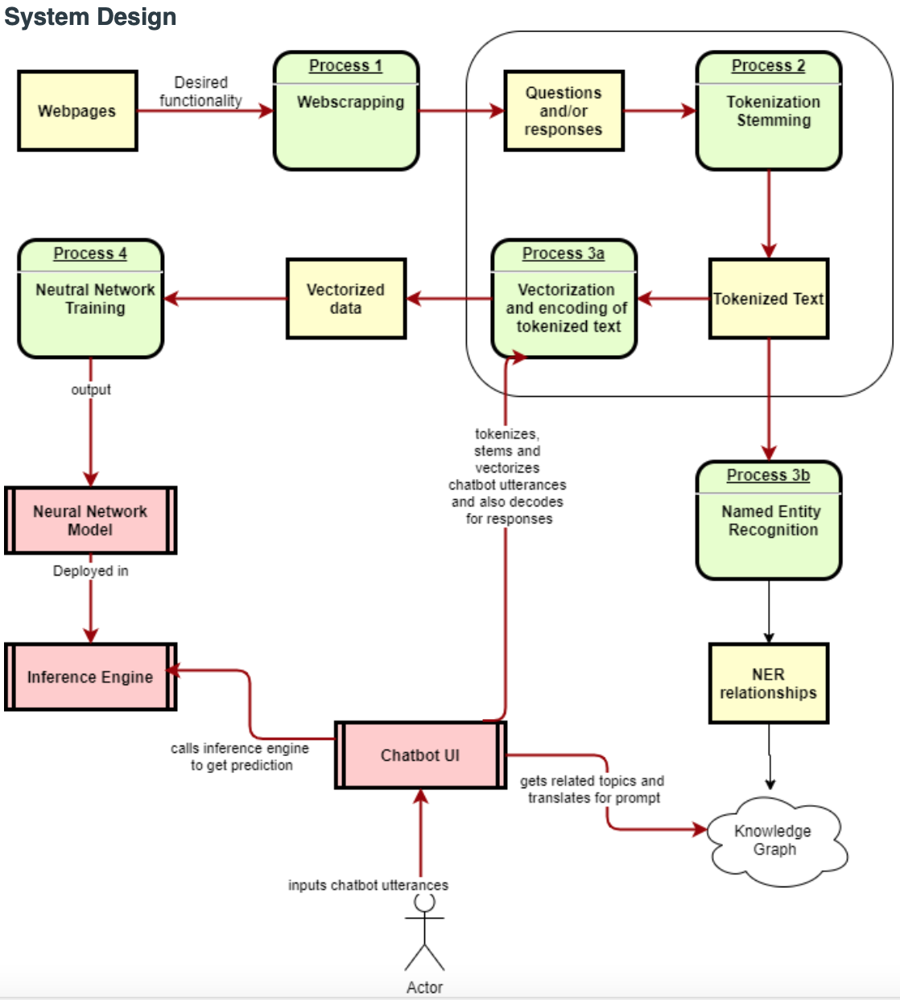

## SECTION 1 : PROJECT TITLE

### AI-driven chatbot for DBS Limited

## SECTION 2: EXECUTIVE SUMMARY
This project is the first step
to develop an AI-driven chatbot tailored for DBS Limited, designed to elevate customer service by automating interactions, predicting customer intents, and integrating with banking microservices. The first phase will aim to automate customer service interactions with high accuracy and personalization by predicting and respond to customer intents with minimal human intervention.

## SECTION 3: Background/Aims/Objectives
Background
Chatbots have been deployed to various usage in various industries today; of which there are rule based chatbots with rudimentary pre-defined pathways to guide the customer journey, as well as, transactional chatbots that limit human interaction to predefined options towards an eventual goal e.g. request ticket, completed fund transfer.

Often, chatbots take a hybrid approach, requiring human developers and sponsors to undertake the role of designing the customer journeys with fixed interaction patterns that are often repetitive. 

Examples include simple scenarios such as bank customers intending to transfer money; often such journeys are predefined customer journeys whereby the customer firstly asks about their account balance, then makes a decision to transfer money. 

## SECTION 4: Problem
Chatbots often struggle to understand user queries that are complex, ambiguous, or poorly structured especially those involving implied or multiple intents, leading to frustrating user experiences.
This is often compounded for users who have complex requests such as application for bank accounts where there is often multiple exchanges to correct submitted information and disjointed due to such exchanges taking pace across a span of time.

Example(s)

There is no relational linkage between credit card and balance.

## SECTION 5: Market Research
Chatbot usage is ubiquitous; any company offering products to a sizeable customer base that requires customer servicing and addressing of concerns can benefit from deploying chatbots to reduce the dependency on human customer service officers.

Key Providers for construction of chatbots involve the following:
Google - Dialogflow, a platform for building chatbots and conversational AI interfaces.
Microsoft - Microsoft Bot Framework and Azure Bot Services, offering tools and services for developing chatbots.
IBM Watson Assistant, a conversational AI platform for building chatbots.
Amazon Lex, a service for building conversational interfaces using voice and text.
Facebook Messenger API for building chatbots on Facebook Messenger.
Rasa - open-source machine learning framework for automated text and voice-based conversations.
OpenAI - GPT-3 and ChatGPT, offering advanced language models that can be utilized for creating sophisticated chatbot applications.

We move away from solutions that cannot be employed on-premises or solutions that offer a less customizable approach.

Following are reference implementations that will inform of our approach:
Botpress for its visual flow builder
Wit.ai, Gnani, Wiz AI for their predictive capabilities

## SECTION 6: Implementation
Implementation for the following:
 Webscrapper
 Text Preprocessor – Tokenizer and Stemmer, Spell Auto correction
 Text Encoder – vectorize-encodes and decodes
 Model Trainer – train neural network
 Inference Engine – predicts intent 
 Named Entity Recognizer –recognizes NER
 Knowledge Graph (KG) – inputs NER in Knowledge Graph
 KG engine – relates NER to each other and to Intent labels
 Chatbot UI – UI interface for chatbot user

## SECTION 7: CREDITS / PROJECT CONTRIBUTION
| Official Full Name  | Student ID (MTech Applicable)  | Work Items (Who Did What) | Email (Optional) |
| :------------ |:---------------:| :-----| :-----|
| Lee Ming Fung (Mike) | A0291994J | Overall system design, Documentation, Chatbot implemention,Backend logic | e1336959@u.nus.edu |
| Lee Pei Wen Celina | A0292305J | Overall system design, Documentation| e1339816@u.nus.edu |
| Su Su San | A0292250L | Data Acquisition, Data Processing, Knowledge Graph system design, Neo4j deployment and query,Backend logic | e1339295@u.nus.edu |
| Lo Weng Cheong Jason | A0292310R | Overall system design, Documentation | e1339821@u.nus.edu |

## SECTION 8 : VIDEO OF SYSTEM MODELLING & USE CASE DEMO
